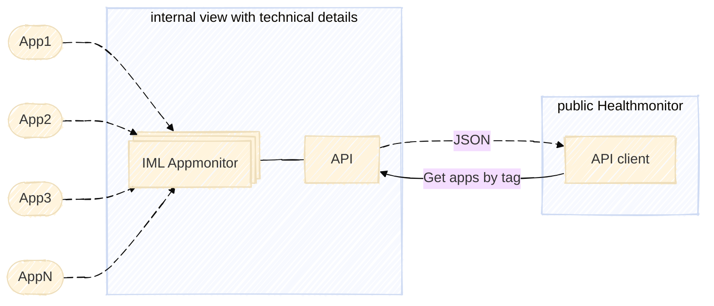

## Introduction

The **IML Appmonitor** is a tool for internal usage. For developers, Devops, Sysadmins. It offers details that shouldn't be for the public.

To show the health status for a public audience you need to hide all technical details. For security reasons on one hand and to not confuse the visitors with unknown buzzwords on the other.

The API client helps you to fetch API data. It handles the encryption for HMAC authentication. The response is JSON.

**Links**:

* IML Appmonitor <https://github.com/iml-it/appmonitor>
* Description of API <https://os-docs.iml.unibe.ch/appmonitor/Server/API.html>

