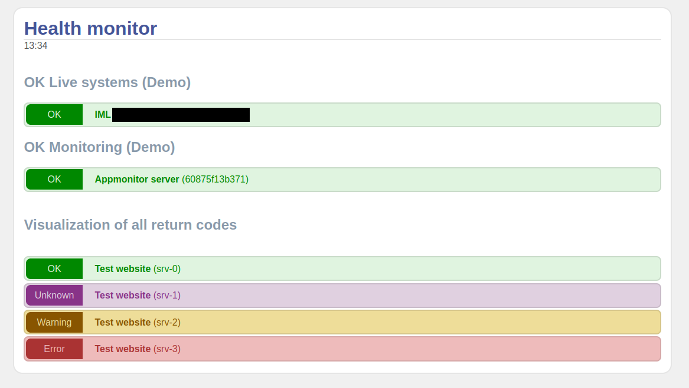

# APPMONITOR API CLIENT

The IML Appmonitor is a complementing tool next to the classic system monitoring
of servers and its services.
See <https://github.com/iml-it/appmonitor>

The API can be configured to be accessed anonymous, with basic authentication or hmac hash key.

This repository contains

* A php class to bastract user authentication and simplify fetching application data using a group of tags
* An example webpage for a customer view with low detail level
* A Bash script using curl

Free software and Open Source from University of Bern :: IML - Institute of Medical Education

📄 Source: <https://github.com/iml-it/appmonitor-api-client> \
📜 License: GNU GPL 3.0 \
📗 Docs: TODO; see readme.md in the subfolders so far

## Screenshot

PHP example page

