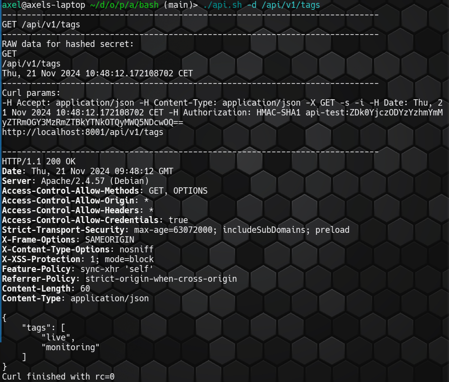

# APPMONITOR API CLIENT

The IML Appmonitor is a complementing tool next to the classic system monitoring
of servers and its services.
See <https://github.com/iml-it/appmonitor>

The API can be configured to be accessed anonymous, with basic authentication or hmac hash key.

This repository contains

* A php class to bastract user authentication and simplify fetching application data using a group of tags
* An example webpage for a customer view with low detail level
* A Bash script using curl

Free software and Open Source from University of Bern :: IML - Institute of Medical Education

📄 Source: <https://github.com/iml-it/appmonitor-api-client> \
📜 License: GNU GPL 3.0 \
📗 Docs: <https://os-docs.iml.unibe.ch/appmonitor-api-client/>

## Screenshots

### PHP example page

You can display multiple application groups using different tag combinations.

### Bash client

The bash client uses curl and suports

* anonymous access
* basic authentication
* HMAC hashing with a shared secret

You can request an api url to get the JSON response. This example fetches the existing tags:

With parameter `-d` you can debug your request for troubleshooting. You see the used curl parameters and http response header:

